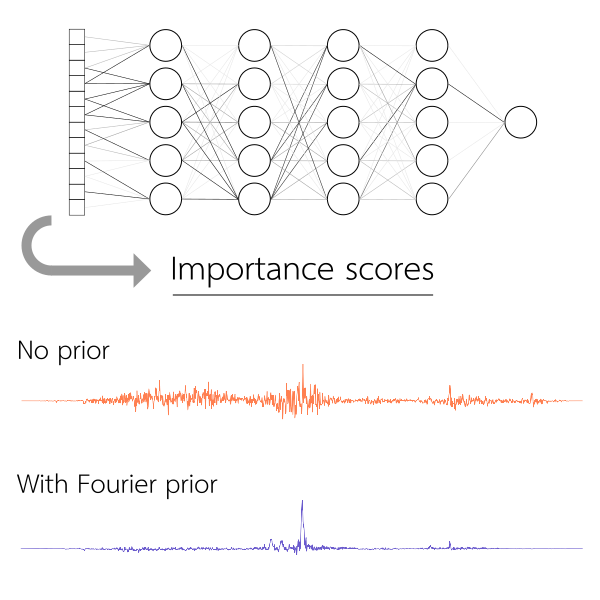
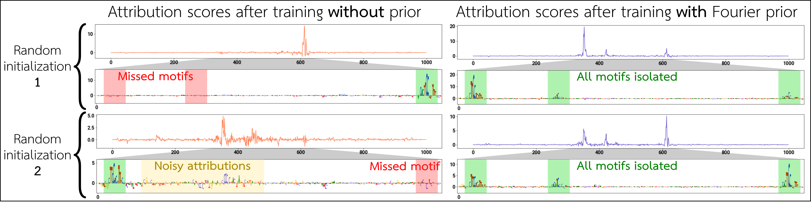
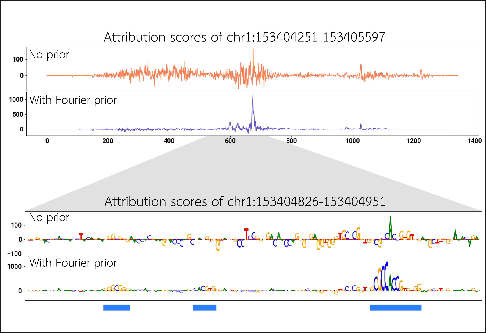

# Fourier-transform-based attribution priors for deep learning in genomics

<p align="center">
    
</p>

### Introduction

Deep learning models in genomics can achieve state-of-the-art performance in predicting biological function from DNA sequences, but these models suffer in interpretability. If we examine the input sequence attributions (i.e. importance scores), they tend to be noisy and irreproducible across random seeds. This seriously hinders our ability to interpret these models and figure out the sequence features that drive biology.

To address these issues, deep learning models can be trained with an attribution prior, which encourages the model at training-time to learn cleaner attributions, thereby making the models more interpretable. Here, we devise an attribution prior based on Fourier transforms to aid in the interpretability of deep learning models for genomics (although such a prior might be uesful in other fields/applications, as well).

See the [corresponding paper](https://proceedings.neurips.cc/paper/2020/hash/1487987e862c44b91a0296cf3866387e-Abstract.html) for more information.

This repository houses all of the code used to generate the results for the paper, including code that fetches data, processes data, trains models, implements the attribution prior, and generates all figures in the paper.

### Results

**Figure 1**
<p align="center">
    
</p>

Models trained with the standard approach (left) irreproducibly miss motifs in the underlying sequence and noisily rely on irrelevant regions of the input. When training with the Fourier-based attribution prior (right), models consistently and cleanly identify the driving motifs. The examples shown are from binary binding models of the SPI1 TF from TF ChIP-seq experiments.

**Figure 2**
<p align="center">
    
</p>

We train profile models to predict chromatin accessibility in the K562 cell line. At a particular K562 open chromatin peak, we show the attributions across the entire input sequence, and the base-pair-level attributions around the summit region. The model trained with the Fourier-based prior cleanly highlights 3 motifs centered around the peak summit, matching relevant transcription factors (left to right: SP1, CLOCK, and CTCF).

For more results/analyses, see the [corresponding paper](https://proceedings.neurips.cc/paper/2020/hash/1487987e862c44b91a0296cf3866387e-Abstract.html).

### Getting started

There are two standalone Jupyter notebooks that will walk you through how to implement and use the Fourier-based attribution prior. They are implemented in PyTorch or Keras/TensorFlow 2.

- [Link to PyTorch example](notebooks/fourier_prior_example_pytorch.ipynb)
- [Link to Keras/TensorFlow 2 example](notebooks/fourier_prior_example_keras.ipynb)

Below are the libraries needed to run these example notebooks. These are the exact versions that I have. You can probably get away with slightly different versions of some of these libraries, but if the versioning is too different, it may break some parts of the notebook.

- Python 3.7.4
- NumPy 1.17.2
- Pandas 0.25.2
- Scipy 1.3.1
- scikit-learn 0.21.3
- Matplotlib 3.1.1
- pyfaidx 0.5.5.2
- tqdm 4.41.1
- PyTorch 1.3.0 (for PyTorch example)
- TensorFlow 2.3.1 (for Keras/TensorFlow 2 example)
- Keras 2.4.3 (for Keras/TensorFlow 2 example)

### Citing this work

If you found Fourier-based attribution priors to be helpful for your work, please cite the following:

Tseng, A. M., Shrikumar, A. & Kundaje, A. Fourier-transform-based attribution priors improve the interpretability and stability of deep learning models for genomics. NeurIPS (2020) [Link](https://proceedings.neurips.cc/paper/2020/hash/1487987e862c44b91a0296cf3866387e-Abstract.html).

[\[BibTeX\]](references/biorxiv.bib)

### Description of files

```
├── Makefile    <- Installation of dependencies
├── data    <- Contains training data
│   ├── interim    <- Intermediate data
│   ├── processed    <- Processed data ready for training
│   ├── raw    <- Raw data, directly downloaded from the source
│   └── README.md    <- Description of data
├── models
│   └── trained_models    <- Trained models
├── infra    <- Code needed to run training jobs on the cloud (Google Cloud Platform or Nautilus)
├── notebooks    <- Jupyter notebooks that explore data, plot results, and generate figures for the paper
├── README.md    <- This file
├── results    <- Saved results
├── references    <- Explanatory materials for this README file
└── src    <- Source code
    ├── data
    │   ├── create_binary_bins.py    <- Synthesize bin-level (aggregate) labels from task-specific binary labels
    │   ├── create_BPNet_profile_hdf5.py    <- Create profile labels from profile tracks
    │   ├── create_ENCODE_DNase_profile_hdf5.py    <- Create profile labels from profile tracks
    │   ├── create_ENCODE_TFChIP_profile_hdf5.py    <- Create profile labels from profile tracks
    │   ├── download_ENCODE_DNase_data.py    <- Download DNase-seq peaks/BAMs from ENCODE portal
    │   ├── download_ENCODE_TFChIP_cellline_peaks.py    <- Download specific TF's and cell line's TF ChIP-seq peaks/BAMs from ENCODE portal
    │   ├── download_ENCODE_TFChIP_data.py    <- Download specific TF's TF ChIP-seq peaks/BAMs from ENCODE portal
    │   ├── generate_BPNet_binary_labels.sh    <- Generate binary labels for Nanog/Oct4/Sox2 models from peaks
    │   ├── generate_ENCODE_DNase_binary_labels.sh    <- Generate binary labels for DNAse-seq models from peaks
    │   ├── generate_ENCODE_DNase_profile_labels.sh    <- Generate profile tracks for DNase-seq models from read tracks
    │   ├── generate_ENCODE_TFChIP_binary_labels.sh    <- Generate binary labels for TF ChIP-seq models from peaks
    │   └── generate_ENCODE_TFChIP_profile_labels.sh    <- Generate profile tracks for TF ChIP-seqmodels form read tracks
    ├── extract
    │   ├── cluster_gradients.py    <- Helper functions for clustering similar importance score tracks
    │   ├── compute_ism.py    <- Compute _in silico_ mutagenesis scores
    │   ├── compute_predictions.py    <- Compute model predictions and gradients from a trained model
    │   ├── compute_shap.py    <- Compute DeepSHAP importance scores from a trained model
    │   ├── data_loading.py    <- Data loading utilities to easily get model input data for a coordinate/bin
    │   ├── dinuc_shuffle.py    <- Shuffling sequences, preserving dinucleotide frequencies
    │   ├── extract_bed_interval.sh    <- Extract a set of BED intervals overlapping a range
    │   ├── __init__.py
    │   ├── make_shap_scores.py    <- Generate DeepSHAP scores over all positive examples
    │   └── run_tfmodisco.py    <- Run TF-MoDISco on DeepSHAP scores to discover motifs
    ├── feature
    │   ├── __init__.py
    │   ├── make_binary_dataset.py    <- Data loading for binary models
    │   ├── make_profile_dataset.py    <- Data loading for profile models
    │   └── util.py    <- Shared data loading utilities
    ├── model
    │   ├── binary_models.py    <- Binary model architecture(s)
    │   ├── binary_performance.py    <- Binary model performance metrics
    │   ├── binary_performance_test.py    <- Tests for binary model performance metric code correctness
    │   ├── hyperparam.py    <- Wrapper for hyperparameter tuning
    │   ├── __init__.py
    │   ├── profile_models.py    <- Profile model architecture(s)
    │   ├── profile_performance.py    <- Profile model performance metrics
    │   ├── profile_performance_test.py    <- Tests for profile model performance metric code correctness
    │   ├── train_binary_model.py    <- Training binary models
    │   ├── train_profile_model.py    <- Training profile models
    │   └── util.py    <- Shared training/model utilities
    ├── motif
    │   ├── generate_simulated_fasta.py    <- Generate a set of synthetic sequences, with embedded motifs
    │   ├── homer2meme.py    <- Convert a HOMER motif file to a MEME motif file
    │   └── run_homer.sh    <- Run HOMER 2
    └── plot
        ├── __init__.py
        └── viz_sequence.py    <- Plot an importance score track
```
